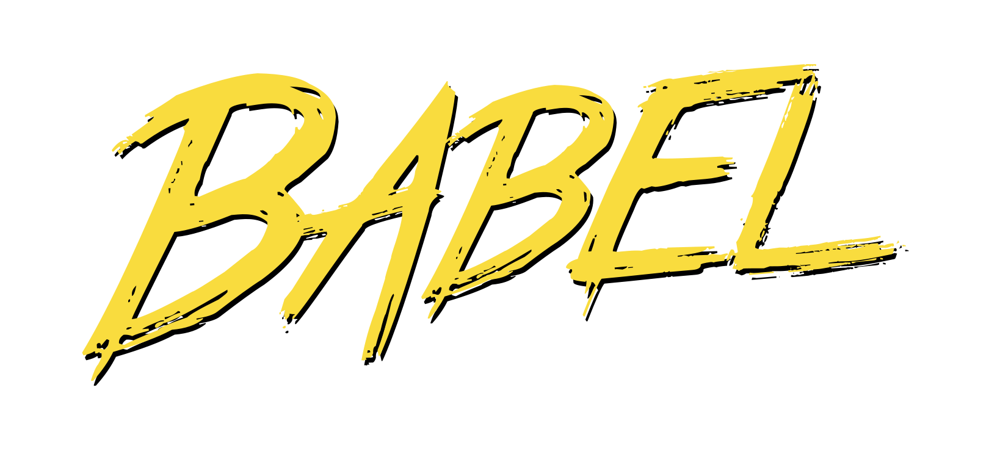

# How to not use jQuery

Callum Macrae | @callumacrae

----

# @callumacrae

JavaScript Developer at Lost My Name

Author of "Learning from jQuery"

----

# What even is jQuery?

----

## What even is jQuery?

```js
var $uncle = $('.foo').parent().next();
$uncle.css('background-color', 'red');
```

----

## What even is jQuery?

```js
$('.foo').on('click', function (e) {
	e.preventDefault();

	$(this).html('This has been clicked!');
});
```

----

## What even is jQuery?

```js
$.get('/user.json', { name: 'Callum' })
	.then(function (data) {
		$('.callum').html('Callum\'s data: ' + data);
	})
	.catch(function (err) {
		$('.callum').text('AJAX request failed :-(');
		console.error(err);
	});
```

----

# What about ES2015?

----

# What about ES2015?

<blockquote class="twitter-tweet" lang="en"><p lang="en" dir="ltr">So, for you, is it ES6 or JavaScript/ES 2015? Alternate options welcomed as responses!</p>&mdash; JavaScript Live (@JavaScriptDaily) <a href="https://twitter.com/JavaScriptDaily/status/662020174837583872">November 4, 2015</a></blockquote>
<script async src="//platform.twitter.com/widgets.js" charset="utf-8"></script>

----

## let + const

```js
if (true) {
	var first = 'inside';
	let second = 'inside';

	console.log(first, second); // inside, inside
}

console.log(first, second); // inside, undefined
```

----

## let + const

```js
// Doesn't work as expected
for (var i = 0; i < 10; i++) {
	setTimeout(function () {
		console.log(i);
	}, 100);
}

// Works as expected
for (var i = 0; i < 10; i++) {
	let j = i;
	setTimeout(function () {
		console.log(j);
	}, 100);
}
```

----

## Destructuring

```js
let [a, b, c] = [1, 2, 3];
let [match, name] = /name: (\S+)/.exec('name: Callum');
let [, name] = /name: (\S+)/.exec('name: Callum');
```

----

## Destructuring

```js
let { one, two, three } = { one: 'Un', two: 'Deux', three: 'Trois' };
console.log(three); // Trois

// Destructuring with function arguments
function logUser({ name, colour }) {
	console.log(name + ' likes ' + colour);
}
logUser({ name: 'Callum', colour: 'orange' });
```

----

## Destructuring

```js
let { one, two, three } = { one: 'Un', two: 'Deux', three: 'Trois' };
console.log(three); // Trois

// Destructuring with function arguments
function logUser({ name, colour }) {
	console.log(name + ' likes ' + colour);
}
logUser({ name: 'Callum', colour: 'orange' });
```

```js
// { name } == { name: name }
```

----

## Default arguments

```js
function log(msg, level = 'log') {
	console[level](msg);
}

log('console.log()');
log('console.error()', 'error');
```

----

## Default arguments + destructuring

```js
function greet({ greeting = 'hello', greetee = 'world' }) {
  console.log(greeting + ', ' + greetee + '!');
}

greet({ greetee: 'Front-End London' });
```

----

# Replacing jQuery

----

## DOM: Selecting

```js
// jQuery
$('.user .user__name')

// JavaScript
document.querySelectorAll('.user .user__name');
```

----

## DOM: Iterating with forEach

```js
// jQuery
$('.user').each(function () {
	console.log(this);
});

// JavaScript
let users = document.querySelectorAll('.user');
Array.from(users).forEach(function (user) {
	console.log(user);
});
```

----

## DOM: Iterating with an iterator

```js
// jQuery
$('.user').each(function () {
	console.log(this);
});

// JavaScript
let users = document.querySelectorAll('.user');
for (let user of users) {
	console.log(user);
}
```

----

## DOM: Selecting children

```js
// jQuery
$('.user').find('.user__tag');

// JavaScript
let users = document.querySelectorAll('.user');
let tags = [];

for (let user of users) {
	tags.push(...user.querySelectorAll('.user__tag'));
}
```

----

## DOM: <code>.next()</code> / <code>.previous()</code> / <code>.parent()</code>

```js
let $user = $('.user');
let user = document.querySelector('.user');

$user.next();
user.nextElementSibling;

$user.previous();
user.previousElementSibling;

$user.parent();
user.parentNode;
```

----

## DOM: Attributes

```js
$user.attr('aria-live');
user.getAttribute('aria-live');

$user.attr('aria-live', 'Your username is invalid');
user.setAttribute('aria-live', 'Your username is invalid');

// Data attributes have a special API
user.dataset.userName = 'Callum';
user.dataset.userName; // Callum
```

----

## DOM: <code>.html()</code> / <code>.text()</code> / <code>.val()</code>

```js
let $user = $('.user');
let user = document.querySelector('.user');

$user.html();
user.innerHTML;

$user.text();
user.textValue; // Not innerText!

$('.some-input').val();
document.querySelector('.some-input').value;
```

----

## DOM: Classes

```js
let $user = $('.user');
let user = document.querySelector('.user');

$user.addClass('user--admin');
user.classList.add('user--admin');

$user.removeClass('user--admin');
user.classList.remove('user--admin');

$user.toggleClass('user--admin');
user.classList.toggle('user--admin');

$user.hasClass('user--admin');
user.classList.contains('user--admin');
```

----

## DOM: Styling

```js
let $user = $('.user');
let user = document.querySelector('user');

$user.css('background-color', 'orange');
user.style.backgroundColor = 'orange';

$user.css('background-color');
getComputedStyle(user).backgroundColor;
```

----

## Event handling

```js
$('.user').on('click', function () {
	$(this).addClass('clicked');
});

let user = document.querySelector('user');
user.addEventListener('click', function () {
	user.classList.add('clicked');
});
```

----

## Event handling

```js
$(document).on('click', '.user', function () {
	$(this).addClass('clicked');
});

document.addEventListener('click', function (e) {
	if (e.target.matches('.user')) {
		e.target.classList.add('clicked');
	}
});
```

----

## Event handling

```js
$(document).on('click', '.user', function () {
	$(this).addClass('clicked');
});

function live(selector, event, cb) {
	document.addEventListener(event, function (e) {
		if (e.target.matches(selector)) {
			cb(e);
		}
	});
}

live('.user', 'click', function (e) {
	e.target.classList.add('clicked');
});
```

----

## <code>$.Deferred()</code>

```js
var deferred = $.Deferred();

$('.yes').on('click', function () {
	deferred.resolve();
});

$('.no').on('click', function () {
	deferred.reject();
});

deferred
	.then(function () {
		console.log('success');
	})
	.fail(function () {
		console.log('fail');
	});
```

----

## Promises

```js
var promise = new Promise(function (resolve, reject) {
	$('.yes').on('click', resolve);
	$('.no').on('click', reject);
});

promise
	.then(() => console.log('success'))
	.catch(() => console.log('fail'));
```

----

## <code>$.ajax()</code>

```js
$.get('/api')
	.then(function (data) {
		console.log(data);
	})
	.catch(function (err) {
		console.error(err);
	});
```

----

## <code>XMLHttpRequest</code> <span class="emoji">&#x1F614;</span>

```js
var request = new XMLHttpRequest();
request.open('GET', '/api');

request.onload = function () {
	var data = this.response;
	if (this.status >= 200 && this.status < 400) {
		console.log(data);
	} else {
		console.error(data);
	}
};

request.onerror = function (err) {
	console.error(err);
};

request.send();
```

----

## Fetch

```js
fetch('/api')
	.then((res) => res.json());
	.then((data) => console.log(data))
	.catch((err) => console.error(err));
```

<p style="font-size: 0.75em; margin-top: 20px">
	<a href="https://github.com/github/fetch">
		GitHub polyfill for <code>fetch()</code>
	</a>
</p>

----

## Post form data

```js
// jQuery
$.post('/api', $('.my-form').serialize());

// JavaScript
let form = document.querySelector('.my-form');
fetch('/api', {
	method: 'post',
	body: new FormData(form)
});
```

----

## Array helpers

```js
// Each
$.each(['a', 'b', 'c'], function (i, letter) {
	console.log(letter);
});

['a', 'b', 'c'].forEach(function (letter) {
	console.log(letter);
});

// Map
$.map(['a', 'b', 'c'], function (i, letter) {
	return letter.charCodeAt(0);
});

['a', 'b', 'c'].map(function (letter) {
	return letter.charCodeAt(0);
});
```

----

## MORE array helpers

```js
// ECMAScript 5
Array.prototype.reduce()
Array.prototype.filter()
Array.prototype.every()
Array.prototype.some()

// ECMAScript 6
Array.from() // second argument!
Array.of()
Array.prototype.entries()
Array.prototype.keys()
Array.prototype.values()
Array.prototype.find()
Array.prototype.findIndex()
Array.prototype.fill()

```

----

## JSON

```js
$.parseJSON(data)
```

----

## &nbsp;

## ಠ_ಠ

----

## Merging objects

```js
// jQuery
function myPlugin(options) {
	options = $.extend({
		color: 'red',
		size: 3
	}, options);
}

// JavaScript
function myPlugin(options) {
	options = Object.assign({
		color: 'red',
		size: 3
	}, options);
}
```

----

## Cloning objects

```js
$.extend({}, objectToClone);

Object.assign({}, objectToClone);
```

----

## Animation

- CSS animations
- requestAnimationFrame
- A library like [GSAP](http://greensock.com/gsap)

----



----

# Is jQuery necessary?

----

## Old versions of Internet Explorer

<iframe src="//giphy.com/embed/SP58bfyWGP1pC" width="480" height="273" frameBorder="0"></iframe>

----

<h2 style="margin-top: -30px">Old versions of Internet Explorer</h2>

<iframe src="http://caniuse.com/#feat=css-sel3" width="1000" height="600"></iframe>

----

## Low barrier to entry

----

## A bajillion libraries

----

## Browser quirks

<blockquote class="twitter-tweet" lang="en"><p lang="en" dir="ltr">You might not need jQuery if you prefer to write your own shims, loops, error checks, and workarounds for inexplicable browser actions.</p>&mdash; Dave Methvin (@davemethvin) <a href="https://twitter.com/davemethvin/status/428979756236038144">January 30, 2014</a></blockquote>
<script async src="//platform.twitter.com/widgets.js" charset="utf-8"></script>

[Rick Waldron's list of 110 quirks fixed by jQuery](https://gist.github.com/rwaldron/8720084#file-reasons-md)

----

# More ES2015

----

## Template literals

```js
let name = 'Callum';

let oldGreeting = 'Hello ' + name + '!\n\n'
	+ 'Welcome to Earth.';

let greeting = `Hello ${name}!

Welcome to Earth.`;
```

----

## Spread operator

```js
function logSecondArgument(one, two, three) {
	console.log(two);
}

let numbers = [1, 2, 3];

logSecondArgument(...numbers); // two

// Equivalent to:
logSecondArgument(1, 2, 3);

// Before ES2015:
logSecondArgument.apply(this, numbers); // two
```

----

## Spread operator

```js
let numbers = [1, 2, 3];

[...numbers, 4, 5, 6]; // [1, 2, 3, 4, 5, 6]
```

----

## Spread operator

```js
let [one, two, ...more] = [1, 2, 3, 4, 5];

console.log(more); // [3, 4, 5]
```

----

## Generators

```js
function* count() {
    yield 1;
    yield 2;
    yield 3;
}

var counter = count();

counter.next(); // {value: 1, done: false}
counter.next(); // {value: 2, done: false}
counter.next(); // {value: 3, done: false}

counter.next(); // {done: true, value: undefined}
```

----

## Generators

```js
function* range(start, end) {
    for (let i = start; i <= end; i++) {
        yield i;
    }
}

for (let i of range(5, 8)) {
    console.log(i);
}
```

[Read more on my blog](http://macr.ae/article/iterators-and-generators.html)

----

## Classes

```js
class Developer {
	constructor(name, languages) {
		this.name = name;
		this.languages = languages;
	}
	intro() {
		console.log(`I'm ${this.name} and I write ${this.languages.join(',')}.`);
	}
}

class JavaScriptDeveloper extends Developer {
	constructor(name, languages = ['JavaScript']) {
		super(name, languages);
	}
}

let callum = new JavaScriptDeveloper('Callum');
callum.intro(); // I'm Callum and I write JavaScript.
```

----

## Classes

```js
class Person {
	constructor(name, age) {
		this._age = age;
	}
	
	get age() { return this._age; }
	
	set age(newAge) {
		if (typeof newAge !== 'number') {
			throw new Error('Age must be a number');
		}
		this._age = age;
	}
}

let bob = new Person('Bob', 49);
bob.age; // 49
bob.age = 'ten'; // Age must be a number
```

----

## Classes

```js
class Number {
	constructor(value) {
		this.value = value;
	}
	
	static max(...nums) {
		return nums.reduce(function (acc, curr) {
			return (curr.value > acc.value) ? curr : acc;
		});
	}
}

let seven = new Number(7);
let eight = new Number(8);
let zero = new Number(0);

seven.max === undefined;
Number.max(seven, eight, zero) === eight;
```

----

# ES2016?!

----

# How to not use jQuery

- Everything jQuery does can be done without jQuery
- ES2015 makes writing vanilla JavaScript even nicer
- jQuery absolutely still has its place
	- Better browser support
	- Much easier to use

----

# Is jQuery really necessary?

Callum Macrae | @callumacrae
